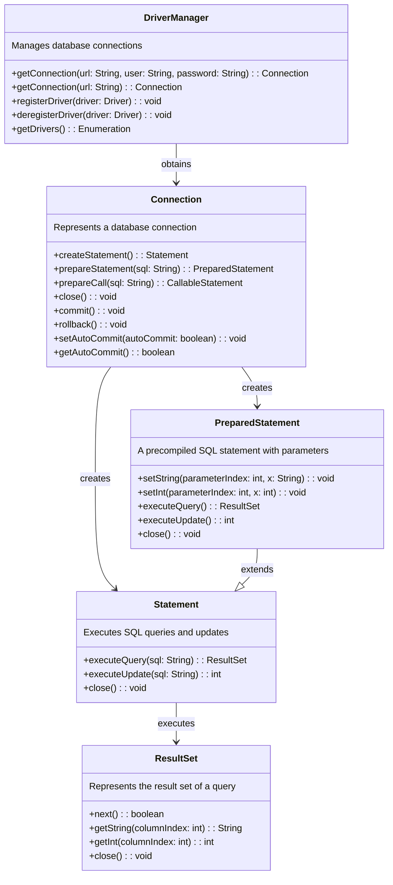
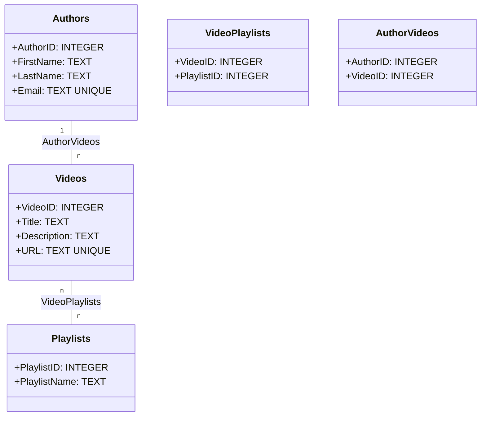

# SQL-tietokantojen käyttö Javasta käsin

## JDBC-luokat




## Tietokannan entiteetit





## SQL-luontikäskyt

```sql
-- Create the Authors table
CREATE TABLE IF NOT EXISTS Authors (
    AuthorID INTEGER PRIMARY KEY,
    FirstName TEXT NOT NULL,
    LastName TEXT NOT NULL,
    Email TEXT UNIQUE
);

-- Create the Videos table
CREATE TABLE IF NOT EXISTS Videos (
    VideoID INTEGER PRIMARY KEY,
    Title TEXT NOT NULL,
    Description TEXT,
    URL TEXT UNIQUE
);

-- Create the Playlists table
CREATE TABLE IF NOT EXISTS Playlists (
    PlaylistID INTEGER PRIMARY KEY,
    PlaylistName TEXT NOT NULL
);

-- Create a junction table to represent the many-to-many relationship between Videos and Playlists
CREATE TABLE IF NOT EXISTS VideoPlaylists (
    VideoID INTEGER,
    PlaylistID INTEGER,
    PRIMARY KEY (VideoID, PlaylistID),
    FOREIGN KEY (VideoID) REFERENCES Videos (VideoID),
    FOREIGN KEY (PlaylistID) REFERENCES Playlists (PlaylistID)
);

-- Create a junction table to represent the many-to-many relationship between Authors and Videos
CREATE TABLE IF NOT EXISTS AuthorVideos (
    AuthorID INTEGER,
    VideoID INTEGER,
    PRIMARY KEY (AuthorID, VideoID),
    FOREIGN KEY (AuthorID) REFERENCES Authors (AuthorID),
    FOREIGN KEY (VideoID) REFERENCES Videos (VideoID)
);

-- Sample data for Authors
INSERT INTO Authors (FirstName, LastName, Email) VALUES
    ('John', 'Doe', 'john.doe@example.com'),
    ('Jane', 'Smith', 'jane.smith@example.com'),
    ('Bob', 'Johnson', 'bob.johnson@example.com');

-- Sample data for Videos
INSERT INTO Videos (Title, Description, URL) VALUES
    ('Introduction to SQL', 'A brief introduction to SQL queries.', 'https://www.example.com/sql_intro'),
    ('Python Basics', 'Learn the fundamentals of Python programming.', 'https://www.example.com/python_basics'),
    ('Web Development Fundamentals', 'Getting started with web development.', 'https://www.example.com/web_dev_fundamentals');

-- Sample data for Playlists
INSERT INTO Playlists (PlaylistName) VALUES
    ('Programming Basics'),
    ('Web Development Essentials');

-- Sample data for VideoPlaylists (playlist assignments)
INSERT INTO VideoPlaylists (VideoID, PlaylistID) VALUES
    (1, 1), -- SQL video in Programming Basics
    (2, 1), -- Python video in Programming Basics
    (3, 2); -- Web Dev video in Web Development Essentials

-- Sample data for AuthorVideos (authorship assignments)
INSERT INTO AuthorVideos (AuthorID, VideoID) VALUES
    (1, 1), -- John authored SQL video
    (1, 2), -- John authored Python video
    (2, 3); -- Jane authored Web Dev video

```

## Esimerkkidata

**Authors Table Sample Data:**

| AuthorID | FirstName | LastName | Email                |
|----------|-----------|----------|----------------------|
| 1        | John      | Doe      | john.doe@example.com |
| 2        | Jane      | Smith    | jane.smith@example.com |
| 3        | Bob       | Johnson  | bob.johnson@example.com |

**Videos Table Sample Data:**

| VideoID | Title                   | Description                          | URL                            |
|---------|-------------------------|--------------------------------------|--------------------------------|
| 1       | Introduction to SQL     | A brief introduction to SQL queries. | https://www.example.com/sql_intro |
| 2       | Python Basics           | Learn the fundamentals of Python programming. | https://www.example.com/python_basics |
| 3       | Web Development Fundamentals | Getting started with web development. | https://www.example.com/web_dev_fundamentals |

**Playlists Table Sample Data:**

| PlaylistID | PlaylistName             |
|------------|--------------------------|
| 1          | Programming Basics       |
| 2          | Web Development Essentials |

**VideoPlaylists Table Sample Data (Playlist Assignments):**

| VideoID | PlaylistID |
|---------|------------|
| 1       | 1          |  -- SQL video in Programming Basics
| 2       | 1          |  -- Python video in Programming Basics
| 3       | 2          |  -- Web Dev video in Web Development Essentials

**AuthorVideos Table Sample Data (Authorship Assignments):**

| AuthorID | VideoID |
|----------|---------|
| 1        | 1       |  -- John authored SQL video
| 1        | 2       |  -- John authored Python video
| 2        | 3       |  -- Jane authored Web Dev video


## Esimerkkikoodi

```java
import java.sql.Connection;
import java.sql.DriverManager;
import java.sql.PreparedStatement;
import java.sql.ResultSet;

public class FetchVideosFromDatabase {
    public static void main(String[] args) {
        // JDBC URL for SQLite database (change this to your database file location)
        String url = "jdbc:sqlite:/path/to/your/database.db";
        
        Connection connection = null;
        PreparedStatement preparedStatement = null;
        ResultSet resultSet = null;

        try {
            // Create a connection to the database
            connection = DriverManager.getConnection(url);

            // SQL query to fetch all videos and their titles
            String sql = "SELECT Title FROM Videos";

            // Create a prepared statement
            preparedStatement = connection.prepareStatement(sql);

            // Execute the query and get the result set
            resultSet = preparedStatement.executeQuery();

            // Iterate through the result set and print video titles
            while (resultSet.next()) {
                String title = resultSet.getString("Title");
                System.out.println("Video Title: " + title);
            }
        } catch (Exception e) {
            e.printStackTrace();
        } finally {
            try {
                // Close the result set, prepared statement, and connection in the finally block
                if (resultSet != null) {
                    resultSet.close();
                }
                if (preparedStatement != null) {
                    preparedStatement.close();
                }
                if (connection != null) {
                    connection.close();
                }
            } catch (Exception e) {
                e.printStackTrace();
            }
        }
    }
}
```

----

Tehtävä on luotu käyttäen ChatGPT:tä (GPT-3.5).
