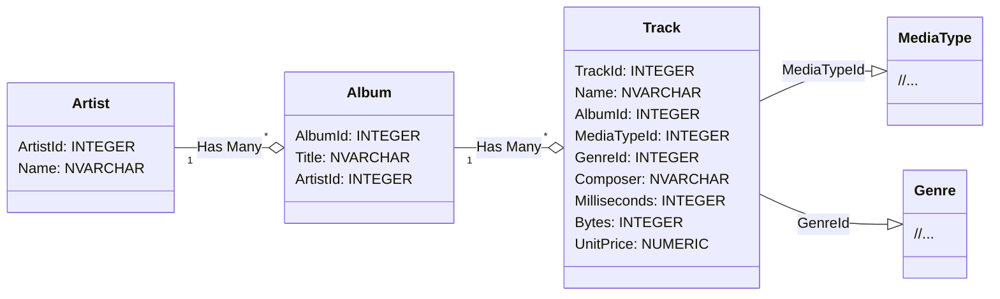
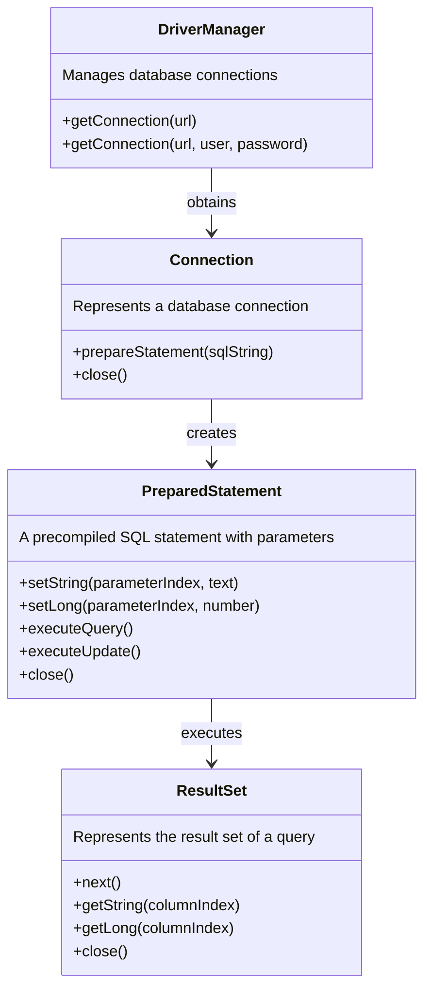

# Using SQL Databases with Java

In this exercise, we will learn how to connect to a database from a Java program and perform simple CRUD operations (Create, Read, Update & Delete). Along the way, we will get acquainted with concepts such as JDBC, DAO, and PreparedStatement.

## JDBC – Java Database Connectivity

The [JDBC (Java Database Connectivity) API](https://docs.oracle.com/javase/8/docs/technotes/guides/jdbc/) defined in the Java standard library allows Java applications to connect to various types of SQL databases and perform different queries and updates from within Java code.

JDBC does not limit which SQL-based databases it can be used with; different databases can be utilized by using the drivers implemented for them. Therefore, from the perspective of your Java code, it does not matter whether you use a [MySQL](https://www.mysql.com/), [PostgreSQL](https://www.postgresql.org/), or [SQLite](https://www.sqlite.org/index.html) type database.

In this task, you can use either a **MySQL** or **SQLite** database according to your preference. By default, we will use the file-based SQLite database. With SQLite, we do not need a separate database server, so we do not have to worry about network connections, passwords, or installations.

## SQLite

SQLite is a local memory or file-based database that does not require a separate server; instead, it can be "embedded" as part of our application:

> *"In contrast to many other database management systems, SQLite is not a client–server database engine. Rather, it is embedded into the end program."*
>
> *"SQLite is a popular choice as embedded database software for local/client storage in application software such as web browsers. It is arguably the most widely deployed database engine, as it is used today by several widespread browsers, operating systems, and embedded systems (such as mobile phones), among others. SQLite has bindings to many programming languages.*"
>
> [https://en.wikipedia.org/wiki/SQLite](https://en.wikipedia.org/wiki/SQLite)

From the perspective of a Java program, SQLite operates in the same way as separate database servers. The SQL queries are also mostly the same, for example, `SELECT ArtistId, Name FROM Artist`. Despite its "lightweight" and file-based nature, SQLite is a very significant database and [is used in popular web browsers and phones](https://www.sqlite.org/famous.html):

> *"SQLite is built into all mobile phones and most computers and comes bundled inside countless other applications that people use every day."*
>
> https://www.sqlite.org/

The SQLite database used in the exercise can be found as a ready-made file in the [data](./data/) directory of this project.

## ⭐ MySQL

Using a MySQL database requires a database server and creating a database on that server. The Programming 2 course can only provide limited guidance on installing the MySQL server and creating the database. However, we encourage you to use MySQL in this exercise if you can manage it independently.

The creation scripts for the MySQL database used in the exercises can be found in the file [data/Chinook_MySql_AutoIncrementPKs.sql](./data/Chinook_MySql_AutoIncrementPKs.sql).

## Adding the driver to the project

JDBC drivers, like other dependencies, [can be downloaded from the internet and placed in the project directories](https://www.google.com/search?q=add+jar+file+to+build+path). However, dependency management is much easier if we use an automation tool like Gradle or Maven. In this exercise template, both SQLite and MySQL drivers are pre-configured in Gradle's [build.gradle](./build.gradle) file, from which your code editor can automatically install them:

```groovy
dependencies {
    // SQLite driver: https://mvnrepository.com/artifact/org.xerial/sqlite-jdbc
    implementation 'org.xerial:sqlite-jdbc:3.+'

    // SQLite driver requires a SLF4J logger https://mvnrepository.com/artifact/org.slf4j/slf4j-simple
    implementation 'org.slf4j:slf4j-simple:2.+'

    // MySQL driver: https://mvnrepository.com/artifact/com.mysql/mysql-connector-j
    // Uncomment the following line, if you wish to use a MySQL database:
    // implementation 'com.mysql:mysql-connector-j:8.+'
}
```

By default, the project includes dependencies for SQLite's JDBC driver and the [SLF4J logging library](https://stackify.com/slf4j-java/) used by the driver.

💡 *You can uncomment the line for the MySQL driver if you want to use a MySQL database in the exercise.*

## Ready-made music database

In this exercise, we will use a ready-made music database called [**Chinook**](https://github.com/lerocha/chinook-database):

> *"Chinook is a sample database available for SQL Server, Oracle, MySQL, etc."*
>
> *"The Chinook data model represents a digital media store, including tables for artists, albums, media tracks, invoices and customers."*
>
> [Luis Rocha, Chinook Database](https://github.com/lerocha/chinook-database)

The Chinook database files are already located in the [data](./data/) directory of this exercise template.

The Chinook database contains numerous tables and a lot of pre-existing data, but in this exercise, we will only use the `Artist` and `Album` tables. You can ignore all other tables in your exercise:



💡 *You are free to explore the contents of the SQLite database by opening it with the [SQLite command-line tool](https://sqlite.org/cli.html) or one of the [many graphical interfaces](https://www.google.com/search?q=sqlite+gui). For exploring the MySQL database, you can use the tool of your choice.*

💡 *If you accidentally modify files and want to revert the changes, you can restore the latest version from version control with the command `git restore data/FILENAME`. On Windows, replace the forward slash `/` with a backslash `\`.*

**More Information about the database:**

* UML Diagram: [Chinook Database Wiki](https://github.com/lerocha/chinook-database/wiki/Chinook-Schema)
* Ready-made Database: [Chinook_Sqlite.sqlite](https://github.com/lerocha/chinook-database/raw/master/ChinookDatabase/DataSources/Chinook_Sqlite.sqlite)
* Documentation: https://github.com/lerocha/chinook-database
* SQL Creation Commands: [Chinook_Sqlite.sql](https://raw.githubusercontent.com/lerocha/chinook-database/master/ChinookDatabase/DataSources/Chinook_Sqlite.sql)
* Database License: [MIT](https://github.com/lerocha/chinook-database/blob/master/LICENSE.md)

## Running the main program

The task template includes the main program [**JdbcDemoMain**](./src/main/java/databases/part01/JdbcDemoMain.java). The purpose of this main program is to help you understand and experiment with how connections are established and how queries can be executed using them. You can run the [main program](./src/main/java/databases/part01/JdbcDemoMain.java) either using the run button in your code editor or with Gradle:

```sh
./gradlew run       # Unix
.\gradlew.bat run   # Windows
```

When you run the program, it will print the names of all the artists already in the database, sorted by their `ArtistId`:

```
AC/DC
Accept
Aerosmith
Alanis Morissette
Alice In Chains
...
```

In the next steps of the exercise, this output will be slightly modified.

⭐ *The main program uses an SQLite database by default, so you will need to change the connection URL and credentials to match your MySQL database if you are using MySQL.*

💡 *If you run the program in VS Code and encounter the error `SQLException: path to 'data/Chinook_Sqlite.sqlite' does not exist`, reopen the project through the "Open Folder..." menu. The SQLite database path is specified in the code as a **relative path** to the project's root directory, so the root directory containing this readme.md file must be open in VS Code.*

## JDBC basics

Database operations in JDBC are performed using three key classes: **Connection**, **PreparedStatement**, and **ResultSet**. These three play a central role in establishing a connection to the database, executing queries, and handling the results.

1. **[Connection](https://docs.oracle.com/javase/8/docs/api/java/sql/Connection.html)**
    - The connection enables interaction between the application and the database.
    - Establishing a connection requires database details, such as the location of the SQLite file. It may also require the database server address, username, and password.
    - The connection should be closed after use to free up resources for reuse.

2. **[PreparedStatement](https://docs.oracle.com/javase/8/docs/api/java/sql/PreparedStatement.html)**
    - A way to execute SQL queries in the database from a Java application.
    - Allows for the safe input of SQL query parameters.
    - Helps prevent SQL injection.

3. **[ResultSet](https://docs.oracle.com/javase/8/docs/api/java/sql/ResultSet.html)**
    - The ResultSet is a set of results obtained from the database, containing the query results.
    - In the ResultSet, data is organized into rows and columns.
    - The result set is typically used in a loop that iterates through the results and retrieves the necessary data.

These classes and their relationships are illustrated in the following diagram:



## Part 1: creating a query and handling results *(basics, 20%)*

In the first part of the exercise, you need to familiarize yourself with the [**JdbcDemoMain**](./src/main/java/databases/part01/JdbcDemoMain.java) main program class and make two small changes to it.

**Modifying the Query**

In the given database query, the data is sorted by the `ArtistId` column. Modify the query so that the artists are sorted alphabetically by name.

**Handling the Result Set**

In the original version of the main program, the name of each artist is printed. Modify the program so that on the same line, after the artist's name, the artist's id (`ArtistId`) is also printed:

```
A Cor Do Som (43)
AC/DC (1)
Aaron Copland & London Symphony Orchestra (230)
Aaron Goldberg (202)
Academy of St. Martin in the Fields & Sir Neville Marriner (214)
```

💡 *Note that the artists are now in a slightly different order. AC/DC is no longer first.*

This part of the task will be checked by examining your program's output, as testing program logic based on `System.out.println` calls is difficult programmatically. This solution also limits code reuse because the `main` method does not return anything. If you need the list of artists later in another part of the program, you will have to repeat the same logic, which is error-prone and makes the code harder to maintain.

A better approach is to isolate the logic into its own methods so that it can be called from other parts of the program or other programs. Dividing the program into parts thus makes it easier to **test** and makes the code more **reusable** and **maintainable**.

🚀 *If you are observant, you will notice that SQLite incorrectly sorted the artist "AC/DC" before the artist "Aaron...". This is because SQLite's ORDER BY comparison is case-sensitive. "Almost correct" order is acceptable for this task, but if you wish, you can also sort the names case-insensitively using the tips from [this discussion](https://stackoverflow.com/a/2413833).*

## Part 2: object-Oriented approach *(basics, 40%)*

In the second part of the exercise, your objective is to utilize object-oriented programming and appropriately divide the database operations into separate classes and methods.

To design the structure and architecture of the program, there are well-known and [widely used design patterns](https://en.wikipedia.org/wiki/Software_design_pattern) that, when followed, will help you apply good practices and hopefully make your code high-quality. Software developers often follow the same design patterns, which makes it easier to understand programs written by others and to standardize coding practices.

**DAO (Data Access Object)**

To separate database logic from the rest of the code, the DAO pattern is often used:

> *"A Data Access Object class can provide access to a particular data resource without coupling the resource's API to the business logic. For example, sample application classes access catalog categories, products, and items using DAO interface `CatalogDAO`."*
>
> Oracle. Data Access Object - Also Known As DAO. https://www.oracle.com/java/technologies/data-access-object.html

**Exercise**

The task template package [databases.part02](./src/main/java/databases/part02/) includes the classes [`Artist`](./src/main/java/databases/part02/Artist.java), [`ArtistDAO`](./src/main/java/databases/part02/ArtistDAO.java), and [`ArtistAppMain`](./src/main/java/databases/part02/ArtistAppMain.java):

1. **Artist:**

    This class represents individual artists in the application and is a "plain old" class. It does not contain any database or user interface logic. Such a class is often referred to as a *model* or *entity*.

2. **ArtistDAO:**

    The ArtistDAO (Data Access Object) class acts as an intermediary between the application's business logic and the database. Its main task is to provide methods for database operations related to the "Artist" entity. These include creating, retrieving, updating, and deleting artists. Implementing database operations in a separate Java class makes it easier for the rest of the application to work with the database, as other classes do not need to know the underlying SQL or database details.

    💡 *The role of the ArtistDAO class is solely to act as an intermediary between the database and the application logic. DAO classes do not contain any user interface logic, such as print statements.*

3. **ArtistAppMain:**

    This class serves as the new main program, utilizing the ArtistDAO class. Logically, this class corresponds to the [`JdbcDemoMain`](./src/main/java/databases/part01/JdbcDemoMain.java) class you used in the previous part, but this time it does not contain any database logic.

The division of responsibilities outlined above follows good principles that make the development, maintenance, and scalability of the application easier. Now that the program is divided into smaller parts, the `main` method used in the previous part can be made to look much simpler:

```java
/**
 * This method functionally corresponds to the method discussed in Part 1,
 * which was much longer and more complex.
 */
public static void main(String[] args) {
    ArtistDAO artistDAO = new ArtistDAO(JDBC_URL);
    List<Artist> artists = artistDAO.getArtists();

    for (Artist artist : artists) {
        System.out.println(artist.getName() + " (" + artist.getId() + ")");
    }
}
```

In this part of the exercise, you need to implement the `getArtists` and `getArtistById` methods in the [`ArtistDAO`](./src/main/java/databases/part02/ArtistDAO.java) class. The method headers and Javadoc comments are already provided in the class.

You can run the [`ArtistAppMain`](./src/main/java/databases/part02/ArtistAppMain.java) class in your code editor. Initially, this class will not print anything, but after implementing the DAO class, the output should be the same as in the previous part of the task.

Your DAO class will be tested with unit tests written in the [`ArtistDAOTest`](./src/test/java/databases/part02/ArtistDAOTest.java) test class. You can run the tests using your code editor's testing tool ([VS Code](https://code.visualstudio.com/docs/java/java-testing), [Eclipse](https://www.vogella.com/tutorials/JUnitEclipse/article.html)e) or the [Gradle automation tool](https://docs.gradle.org/current/userguide/java_testing.html):

```sh
./gradlew test --tests ArtistDAOTest      # unix
.\gradlew.bat test --tests ArtistDAOTest  # windows
```

💡 *Do not change the names, parameters, or return types of the provided methods. Changes may cause issues with testing.*

💡 *Try to avoid repeating longer sections of the same code in both methods. You are allowed to implement additional classes and methods besides those mentioned in the task description. For example, a `Database` class for opening and closing connections might be a good idea. Alternatively, you can implement a separate helper method for closing resources. Your methods can also call each other: you can call the `getArtists` method within the `getArtistById` method (efficiency is not a concern in this task).*

💡 *You may find that closing connections "manually" requires many operations and lines of code. Alternatively, you can familiarize yourself with [Java's try-with-resources](https://www.baeldung.com/java-try-with-resources) syntax, which allows you to close resources automatically.*

💡 *The tests use a different database than the main program. If necessary, refer to the [`TestUtils`](./src/test/java/databases/utils/TestUtils.java) class and its database creation commands.*

## Part 3: adding, updating, and deleting data *(applying, 40%)*

In the previous parts, we retrieved data using the `executeQuery` method. This time, the goal is to add, update, and delete data using the [`executeUpdate` method](https://docs.oracle.com/javase/8/docs/api/java/sql/PreparedStatement.html#executeUpdate--).

The project package [databases.part03](./src/main/java/databases/part03/) includes the classes [`Album`](./src/main/java/databases/part03/Album.java) and [`AlbumDAO`](./src/main/java/databases/part03/AlbumDAO.java). The roles of these classes follow the same pattern as `Artist` and `ArtistDAO`. Implement the following operations in the [`AlbumDAO`](./src/main/java/databases/part03/AlbumDAO.java) class:

* `getAlbumsByArtist(Artist artist)`
* `addAlbum(Album album)`
* `updateAlbum(Album album)`
* `deleteAlbum(Album album)`

The methods are already present in the [`AlbumDAO`](./src/main/java/databases/part03/AlbumDAO.java) class, and their comments describe the required functionalities for each method.

**SQL-injektiot ja tietoturva**

Huomaa, että SQL-kyselyjen muodostaminen merkkijonoja yhdistelemällä aiheuttaa tietoturvaongelmia, kuten [tämä auton rekisterikilpi](https://hackaday.com/wp-content/uploads/2014/04/18mpenleoksq8jpg.jpg) ja oheinen sarjakuva havainnollistavat:

**SQL Injections and Security**

Note that constructing SQL queries by concatenating strings causes security issues, as illustrated by [this car license plate](https://hackaday.com/wp-content/uploads/2014/04/18mpenleoksq8jpg.jpg) and the accompanying comic:

[](https://xkcd.com/327/)

*Picture: Randall Munroe. Exploits of a Mom. [https://xkcd.com/327/](https://xkcd.com/327/). [CC BY-NC 2.5](https://creativecommons.org/licenses/by-nc/2.5/)*

So remember to use the `PreparedStatement` class and its `setString`, `setLong`, and other methods whenever you add parameters to queries. The `set...` methods ensure that the provided data is not interpreted as part of the query, meaning it is treated only as data.

**Testing the solution**

There is no ready-made main program for handling albums, but you can create a new main program, modify the program from the previous part, or use the [`AlbumDAOTest`](./src/test/java/databases/part03/AlbumDAOTest.java) unit tests. `AlbumDAOTest` is technically quite different from the previous tests because it requires initializing the test database to the same starting point before the tests. However, you can run it just like the other tests, either with your code editor or Gradle:

```
./gradlew test --tests AlbumDAOTest      # unix
.\gradlew.bat test --tests AlbumDAOTest  # windows
```

## 🚀 Pro task: Try-with-resources

Closing connections "manually" by calling the `close()` method requires many operations and numerous extra lines of code. Alternatively, you can familiarize yourself with [Java's try-with-resources](https://www.baeldung.com/java-try-with-resources) syntax, which allows you to close resources automatically.

## 🚀 Pro task: using environment variables

Often, the same code is run in numerous different environments, such as on various developers' personal Windows, Mac, and Linux machines. In addition to developers' personal machines, the same code must work in testing, staging, and production environments, which may be located in the cloud or in an on-premises data center. Different environments use different databases and settings, so they require different connection URLs, usernames, and other variable information to use the databases.

Environment-specific settings are not written directly into the program code to avoid having to change, compile, and package the code separately for each execution environment. Usernames, passwords, and API keys are also not stored in the program code or version control for security reasons.

A common way to solve the above problems is to set environment-specific and secret values in the operating system's environment variables. Using environment variables, the application can use, for example, development, test, or production databases without changing the program code. Secret information, such as passwords, is also kept out of the program code.

Environment variables are a kind of operating system-specific Map data structure. The values of environment variables can be read in Java using the `System.getenv` method, for example, as follows.

```diff
+ // the string is read from an environment variable named DATABASE: 👍
+ private static final String JDBC_URL = System.getenv("DATABASE");

- // hardcoded connection URL with an environment-specific address and plaintext password: 😱
- private static final String JDBC_URL = "jdbc:mysql://localhost:3306/Chinook?user=root&password=ThisPasswordWillLeak";
```

### Setting environment variables

You can set an environment variable in VS Code by modifying the ["Run and debug" settings](https://code.visualstudio.com/docs/java/java-debugging#_configuration-options) (see the `env` section). In Eclipse, you can add environment variables to your program following the instructions in this [Stack Overflow thread](https://stackoverflow.com/a/12810433).

Alternatively, environment variables can be defined at the system level:

* [Windows](https://www.google.com/search?q=windows+set+environment+variable)
* [Linux](https://www.google.com/search?q=linux+set+environment+variable)
* [MacOS](https://www.google.com/search?q=macos+set+environment+variable).

----


# Lisenssit

## Chinook-tietokanta

Chinook-tietokannan on luonut [Luis Rocha](https://github.com/lerocha) ja se on lisensoitu [MIT-lisenssillä](https://github.com/lerocha/chinook-database/blob/master/LICENSE.md).


## SQLite-ajurin lisenssi

Lue [Apache License, https://github.com/xerial/sqlite-jdbc/blob/master/LICENSE](https://github.com/xerial/sqlite-jdbc/blob/master/LICENSE).


## MySQL-ajurin lisenssi

Lue [Preface and Legal Notices, https://dev.mysql.com/doc/connector-j/en/preface.html](https://dev.mysql.com/doc/connector-j/en/preface.html).


## Tämä oppimateriaali

Tämän tehtävän on kehittänyt Teemu Havulinna ja se on lisensoitu [Creative Commons BY-NC-SA -lisenssillä](https://creativecommons.org/licenses/by-nc-sa/4.0/).

Tehtävänannon, lähdekoodien ja testien toteutuksessa on hyödynnetty ChatGPT 3.5 -kielimallia sekä GitHub copilot -tekoälyavustinta.
