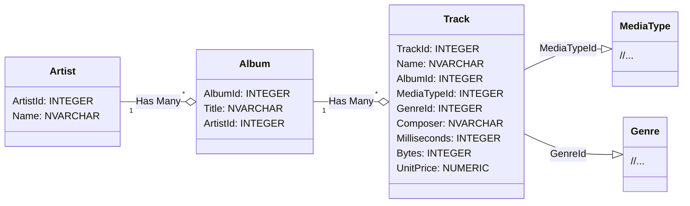
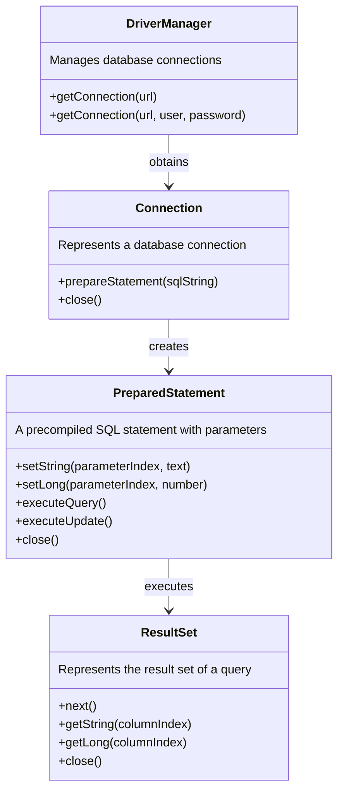

# Using SQL Databases with Java

In this exercise, we will learn how to connect to a database from a Java program and perform simple CRUD operations (Create, Read, Update & Delete). Along the way, we will get acquainted with concepts such as JDBC, DAO, and PreparedStatement.

## JDBC – Java Database Connectivity

The [JDBC (Java Database Connectivity) API](https://docs.oracle.com/javase/8/docs/technotes/guides/jdbc/) defined in the Java standard library allows Java applications to connect to various types of SQL databases and perform different queries and updates from within Java code.

JDBC does not limit which SQL-based databases it can be used with; different databases can be utilized by using the drivers implemented for them. Therefore, from the perspective of your Java code, it does not matter whether you use a [MySQL](https://www.mysql.com/), [PostgreSQL](https://www.postgresql.org/), or [SQLite](https://www.sqlite.org/index.html) type database.

In this task, you can use either a **MySQL** or **SQLite** database according to your preference. By default, we will use the file-based SQLite database. With SQLite, we do not need a separate database server, so we do not have to worry about network connections, passwords, or installations.

## SQLite

SQLite is a local memory or file-based database that does not require a separate server; instead, it can be "embedded" as part of our application:

> *"In contrast to many other database management systems, SQLite is not a client–server database engine. Rather, it is embedded into the end program."*
>
> *"SQLite is a popular choice as embedded database software for local/client storage in application software such as web browsers. It is arguably the most widely deployed database engine, as it is used today by several widespread browsers, operating systems, and embedded systems (such as mobile phones), among others. SQLite has bindings to many programming languages.*"
>
> [https://en.wikipedia.org/wiki/SQLite](https://en.wikipedia.org/wiki/SQLite)

From the perspective of a Java program, SQLite operates in the same way as separate database servers. The SQL queries are also mostly the same, for example, `SELECT ArtistId, Name FROM Artist`. Despite its "lightweight" and file-based nature, SQLite is a very significant database and [is used in popular web browsers and phones](https://www.sqlite.org/famous.html):

> *"SQLite is built into all mobile phones and most computers and comes bundled inside countless other applications that people use every day."*
>
> https://www.sqlite.org/

The SQLite database used in the exercise can be found as a ready-made file in the [data](./data/) directory of this project.

## ⭐ MySQL

Using a MySQL database requires a database server and creating a database on that server. The Programming 2 course can only provide limited guidance on installing the MySQL server and creating the database. However, we encourage you to use MySQL in this exercise if you can manage it independently.

The creation scripts for the MySQL database used in the exercises can be found in the file [data/Chinook_MySql_AutoIncrementPKs.sql](./data/Chinook_MySql_AutoIncrementPKs.sql).

## Adding the driver to the project

JDBC drivers, like other dependencies, [can be downloaded from the internet and placed in the project directories](https://www.google.com/search?q=add+jar+file+to+build+path). However, dependency management is much easier if we use an automation tool like Gradle or Maven. In this exercise template, both SQLite and MySQL drivers are pre-configured in Gradle's [build.gradle](./build.gradle) file, from which your code editor can automatically install them:

```groovy
dependencies {
    // SQLite driver: https://mvnrepository.com/artifact/org.xerial/sqlite-jdbc
    implementation 'org.xerial:sqlite-jdbc:3.+'

    // SQLite driver requires a SLF4J logger https://mvnrepository.com/artifact/org.slf4j/slf4j-simple
    implementation 'org.slf4j:slf4j-simple:2.+'

    // MySQL driver: https://mvnrepository.com/artifact/com.mysql/mysql-connector-j
    // Uncomment the following line, if you wish to use a MySQL database:
    // implementation 'com.mysql:mysql-connector-j:8.+'
}
```

By default, the project includes dependencies for SQLite's JDBC driver and the [SLF4J logging library](https://stackify.com/slf4j-java/) used by the driver.

💡 *You can uncomment the line for the MySQL driver if you want to use a MySQL database in the exercise.*

## Ready-made music database

In this exercise, we will use a ready-made music database called [**Chinook**](https://github.com/lerocha/chinook-database):

> *"Chinook is a sample database available for SQL Server, Oracle, MySQL, etc."*
>
> *"The Chinook data model represents a digital media store, including tables for artists, albums, media tracks, invoices and customers."*
>
> [Luis Rocha, Chinook Database](https://github.com/lerocha/chinook-database)

The Chinook database files are already located in the [data](./data/) directory of this exercise template.

The Chinook database contains numerous tables and a lot of pre-existing data, but in this exercise, we will only use the `Artist` and `Album` tables. You can ignore all other tables in your exercise:



💡 *You are free to explore the contents of the SQLite database by opening it with the [SQLite command-line tool](https://sqlite.org/cli.html) or one of the [many graphical interfaces](https://www.google.com/search?q=sqlite+gui). For exploring the MySQL database, you can use the tool of your choice.*

💡 *If you accidentally modify files and want to revert the changes, you can restore the latest version from version control with the command `git restore data/FILENAME`. On Windows, replace the forward slash `/` with a backslash `\`.*

**More Information about the database:**

* UML Diagram: [Chinook Database Wiki](https://github.com/lerocha/chinook-database/wiki/Chinook-Schema)
* Ready-made Database: [Chinook_Sqlite.sqlite](https://github.com/lerocha/chinook-database/raw/master/ChinookDatabase/DataSources/Chinook_Sqlite.sqlite)
* Documentation: https://github.com/lerocha/chinook-database
* SQL Creation Commands: [Chinook_Sqlite.sql](https://raw.githubusercontent.com/lerocha/chinook-database/master/ChinookDatabase/DataSources/Chinook_Sqlite.sql)
* Database License: [MIT](https://github.com/lerocha/chinook-database/blob/master/LICENSE.md)

## Pääohjelman suorittaminen

Tehtäväpohja sisältää pääohjelman [**JdbcDemoMain**](./src/main/java/databases/part01/JdbcDemoMain.java). Tämä pääohjelman tarkoitus on auttaa sinua hahmottamaan ja kokeilemaan, miten yhteyksiä muodostetaan ja miten niiden avulla voidaan suorittaa kyselyitä. Voit suorittaa [pääohjelman](./src/main/java/databases/part01/JdbcDemoMain.java) joko koodieditorisi run-painikkeella tai Gradle:n avulla:

## Running the main program

The task template includes the main program [**JdbcDemoMain**](./src/main/java/databases/part01/JdbcDemoMain.java). The purpose of this main program is to help you understand and experiment with how connections are established and how queries can be executed using them. You can run the [main program](./src/main/java/databases/part01/JdbcDemoMain.java) either using the run button in your code editor or with Gradle:

```sh
./gradlew run       # Unix
.\gradlew.bat run   # Windows
```

When you run the program, it will print the names of all the artists already in the database, sorted by their `ArtistId`:

```
AC/DC
Accept
Aerosmith
Alanis Morissette
Alice In Chains
...
```

In the next steps of the exercise, this output will be slightly modified.

⭐ *The main program uses an SQLite database by default, so you will need to change the connection URL and credentials to match your MySQL database if you are using MySQL.*

💡 *If you run the program in VS Code and encounter the error `SQLException: path to 'data/Chinook_Sqlite.sqlite' does not exist`, reopen the project through the "Open Folder..." menu. The SQLite database path is specified in the code as a **relative path** to the project's root directory, so the root directory containing this readme.md file must be open in VS Code.*

## JDBC basics

Database operations in JDBC are performed using three key classes: **Connection**, **PreparedStatement**, and **ResultSet**. These three play a central role in establishing a connection to the database, executing queries, and handling the results.

1. **[Connection](https://docs.oracle.com/javase/8/docs/api/java/sql/Connection.html)**
    - The connection enables interaction between the application and the database.
    - Establishing a connection requires database details, such as the location of the SQLite file. It may also require the database server address, username, and password.
    - The connection should be closed after use to free up resources for reuse.

2. **[PreparedStatement](https://docs.oracle.com/javase/8/docs/api/java/sql/PreparedStatement.html)**
    - A way to execute SQL queries in the database from a Java application.
    - Allows for the safe input of SQL query parameters.
    - Helps prevent SQL injection.

3. **[ResultSet](https://docs.oracle.com/javase/8/docs/api/java/sql/ResultSet.html)**
    - The ResultSet is a set of results obtained from the database, containing the query results.
    - In the ResultSet, data is organized into rows and columns.
    - The result set is typically used in a loop that iterates through the results and retrieves the necessary data.

These classes and their relationships are illustrated in the following diagram:



## Part 1: creating a query and handling results *(basics, 20%)*

In the first part of the exercise, you need to familiarize yourself with the [**JdbcDemoMain**](./src/main/java/databases/part01/JdbcDemoMain.java) main program class and make two small changes to it.

**Modifying the Query**

In the given database query, the data is sorted by the `ArtistId` column. Modify the query so that the artists are sorted alphabetically by name.

**Handling the Result Set**

In the original version of the main program, the name of each artist is printed. Modify the program so that on the same line, after the artist's name, the artist's id (`ArtistId`) is also printed:

```
A Cor Do Som (43)
AC/DC (1)
Aaron Copland & London Symphony Orchestra (230)
Aaron Goldberg (202)
Academy of St. Martin in the Fields & Sir Neville Marriner (214)
```

💡 *Note that the artists are now in a slightly different order. AC/DC is no longer first.*

This part of the task will be checked by examining your program's output, as testing program logic based on `System.out.println` calls is difficult programmatically. This solution also limits code reuse because the `main` method does not return anything. If you need the list of artists later in another part of the program, you will have to repeat the same logic, which is error-prone and makes the code harder to maintain.

A better approach is to isolate the logic into its own methods so that it can be called from other parts of the program or other programs. Dividing the program into parts thus makes it easier to **test** and makes the code more **reusable** and **maintainable**.

🚀 *If you are observant, you will notice that SQLite incorrectly sorted the artist "AC/DC" before the artist "Aaron...". This is because SQLite's ORDER BY comparison is case-sensitive. "Almost correct" order is acceptable for this task, but if you wish, you can also sort the names case-insensitively using the tips from [this discussion](https://stackoverflow.com/a/2413833).*

## Osa 2: Olioihin perustuva lähestymistapa *(perusteet, 40 %)*

Tehtävän toisessa osassa tehtävänäsi on hyödyntää olio-ohjelmointia ja jakaa tietokantaa käyttävät operaatiot tarkoituksenmukaisesti erillisiin luokkiin ja metodeihin.

Ohjelman rakenteen ja arkkitehtuurin suunnittelemiseksi on hyviä tunnettuja ja [laajasti käytettyjä suunnittelumalleja (pattern)](https://en.wikipedia.org/wiki/Software_design_pattern), joita noudattamalla tulet soveltaneeksi hyviä käytäntöjä ja koodistasi tulee toivottavasti laadukasta. Ohjelmistokehittäjät noudattavat usein samoja suunnittelumalleja, mikä helpottaa muiden kirjoittamien ohjelmien ymmärtämistä ja koodauskäytäntöjen yhtenäistämistä.

**DAO (Data Access Object)**

Tietokantalogiikan eriyttämiseksi muusta koodista käytetään usein ns. DAO-mallia:

> *"A Data Access Object class can provide access to a particular data resource without coupling the resource's API to the business logic. For example, sample application classes access catalog categories, products, and items using DAO interface `CatalogDAO`."*
>
> Oracle. Data Access Object - Also Known As DAO. https://www.oracle.com/java/technologies/data-access-object.html

**Tehtävä**

Tehtäväpohjan paketissa [databases.part02](./src/main/java/databases/part02/) on valmiina luokat [`Artist`](./src/main/java/databases/part02/Artist.java), [`ArtistDAO`](./src/main/java/databases/part02/ArtistDAO.java) sekä [`ArtistAppMain`](./src/main/java/databases/part02/ArtistAppMain.java):


1. **Artist:**

    Tämä luokka edustaa yksittäisiä artisteja sovelluksessa ja on "aivan tavallinen" luokka. Luokassa ei ole tietokanta- eikä käyttöliittymälogiikkaa. Tällaisesta luokasta käytetään usein nimitystä *model* tai *entity*.

2. **ArtistDAO:**

    ArtistDAO (Data Access Object) -luokka toimii välittäjänä sovelluksen liiketoimintalogiikan ja tietokannan välillä. Sen pääasiallinen tehtävä on tarjota metodeja tietokantaoperaatioihin, jotka liittyvät "Artist" -entiteettiin. Näitä ovat esim artistien luonti, hakeminen, päivittämiseen ja poistamiseen. Tietokantaoperaatioiden toteuttaminen erilliseen Java-luokkaan helpottaa muun sovelluksen työskentelyä tietokannan kanssa, koska muiden luokkien ei tarvitse tuntea taustalla olevaa SQL:ää tai tietokantaan liittyviä yksityiskohtia.

    💡 *ArtistDAO-luokan rooli on ainoastaan toimia välittäjänä tietokannan ja sovelluslogiikan välillä. DAO-luokissa ei ole lainkaan käyttöliittymään liittyvää logiikkaa, kuten tulosteita.*

3. **ArtistAppMain:**

    Tämä luokka toimii uutena pääohjelmana, joka hyödyntää ArtistDAO-luokkaa. Loogisesti tämä luokka vastaa edellisessä osassa käyttämääsi [`JdbcDemoMain`-luokkaa](./src/main/java/databases/part01/JdbcDemoMain.java), mutta tällä kertaa se ei sisällä lainkaan tietokantalogiikkaa.

Yllä esitetty vastuunjakaminen seuraa hyviä periaatteita, jotka tekevät sovelluksen kehittämisestä, ylläpidosta ja skaalautuvuudesta helpompaa. Nyt kun ohjelma on jaettu pienempiin osiin, edellisessä osassa käytetty `main`-metodi saadaan näyttämään paljon yksinkertaisemmalta:

```java
/**
 * Tämä metodi vastaa toiminnallisesti osassa 1 käsiteltyä metodia, joka
 * oli paljon pidempi ja monimutkaisempi.
 */
public static void main(String[] args) {
    ArtistDAO artistDAO = new ArtistDAO(JDBC_URL);
    List<Artist> artists = artistDAO.getArtists();

    for (Artist artist : artists) {
        System.out.println(artist.getName() + " (" + artist.getId() + ")");
    }
}
```

Tehtävän tässä osassa sinun tulee toteuttaa [`ArtistDAO`-luokkaan](./src/main/java/databases/part02/ArtistDAO.java) metodit `getArtists` sekä `getArtistById`. Metodien otsikot ja Javadoc-kommentit löytyvät luokasta valmiina.

Voit suorittaa [`ArtistAppMain`-luokan](./src/main/java/databases/part02/ArtistAppMain.java) koodieditorillasi. Aluksi kyseinen luokka ei tulosta mitään, mutta toteutettuasi DAO-luokan tulosteen pitäisi olla sama kuin tehtävän edellisessä osassa.

DAO-luokkasi testataan yksikkötesteillä, jotka on kirjoitettu [`ArtistDAOTest`-testiluokkaan](./src/test/java/databases/part02/ArtistDAOTest.java). Voit suorittaa testit joko koodieditorisi testaustyökalulla ([VS Code](https://code.visualstudio.com/docs/java/java-testing), [Eclipse](https://www.vogella.com/tutorials/JUnitEclipse/article.html)) tai [Gradle-automaatiotyökalulla](https://docs.gradle.org/current/userguide/java_testing.html):

```sh
./gradlew test --tests ArtistDAOTest      # unix
.\gradlew.bat test --tests ArtistDAOTest  # windows
```

💡 *Älä muuta valmiiden metodien nimiä, parametreja tai paluuarvojen tyyppejä. Muutokset saattavat aiheuttaa ongelmia testauksen kanssa.*

💡 *Yritä välttää toistamasta pidempiä pätkiä samaa koodia molemmissa metodeissa. Saat toteuttaa tehtävänannossa mainittujen luokkien ja metodien lisäksi myös muita luokkia ja metodeja. Esimerkiksi `Database`-luokka yhteyksien avaamiseksi ja sulkemiseksi voi olla hyvä idea. Toisaalta voit toteuttaa erillisen apumetodin resurssien sulkemiseksi. Metodisi saavat myös kutsua toisiaan: voit kutsua `getArtistById`-metodissa `getArtists`-metodia (tehokkuudella ei tässä tehtävässä ole painoarvoa).*

💡 *Tulet mahdollisesti huomaamaan, että yhteyksien sulkeminen "käsin" vaatii monta operaatiota ja koodiriviä. Voit vaihtoehtoisesti perehtyä [Javan try-with-resources](https://www.baeldung.com/java-try-with-resources)-syntaksiin, jolla saat suljettua resurssit automaattisesti.*

💡 *Testeissä käytetään eri tietokantaa kuin pääohjelmassa. Tutustu tarvittaessa [`TestUtils`-luokkaan](./src/test/java/databases/utils/TestUtils.java) ja sen sisältämiin tietokannan luontikäskyihin.*


## Osa 3: Tiedon lisääminen, päivittäminen ja poistaminen *(soveltaminen, 40 %)*

Edellisissä osissa olemme hakeneet tietoa `executeQuery`-metodilla. Tällä kertaa tarkoituksena on lisätä, päivittää ja poistaa tietoa [`executeUpdate`-metodilla](https://docs.oracle.com/javase/8/docs/api/java/sql/PreparedStatement.html#executeUpdate--).

Tämän projektin paketista [databases.part03](./src/main/java/databases/part03/) löytyy luokat [`Album`](./src/main/java/databases/part03/Album.java) sekä [`AlbumDAO`](./src/main/java/databases/part03/AlbumDAO.java). Luokkien roolit noudattavat samaa mallia kuin `Artist` ja `ArtistDAO`. Toteuta [`AlbumDAO`-luokkaan](./src/main/java/databases/part03/AlbumDAO.java) seuraavat operaatiot:

* `getAlbumsByArtist(Artist artist)`
* `addAlbum(Album album)`
* `updateAlbum(Album album)`
* `deleteAlbum(Album album)`

Metodit löytyvät [`AlbumDAO`-luokasta](./src/main/java/databases/part03/AlbumDAO.java) valmiina ja niiden kommentit kuvailevat tarkemmin kultakin metodilta vaaditut toiminnot.


**SQL-injektiot ja tietoturva**

Huomaa, että SQL-kyselyjen muodostaminen merkkijonoja yhdistelemällä aiheuttaa tietoturvaongelmia, kuten [tämä auton rekisterikilpi](https://hackaday.com/wp-content/uploads/2014/04/18mpenleoksq8jpg.jpg) ja oheinen sarjakuva havainnollistavat:

[](https://xkcd.com/327/)

*Kuva: Randall Munroe. Exploits of a Mom. [https://xkcd.com/327/](https://xkcd.com/327/). [CC BY-NC 2.5](https://creativecommons.org/licenses/by-nc/2.5/)*

Muista siis käyttää `PreparedStatement`-luokkaa ja sen `setString`-, `setLong`- ja muita metodeita aina lisätessäsi kyselyihin parametreja. `set...`-metodit huolehtivat siitä, että annettua dataa ei tulkita osaksi kyselyä, eli sitä käsitellään vain datana.


**Ratkaisun testaaminen**

Albumien käsittelemiseksi ei ole valmista pääohjelmaa, mutta voit halutessasi luoda uuden pääohjelman, muokata edellisen osan ohjelmaa tai hyödyntää [`AlbumDAOTest`-yksikkötestejä](./src/test/java/databases/part03/AlbumDAOTest.java). `AlbumDAOTest` on tekniseltä toteutukseltaan melko erilainen kuin aikaisemmat testit, koska siinä joudutaan alustamaan testitietokanta aina samaan alkupisteeseen ennen testejä. Voit kuitenkin suorittaa sen aikan kuten muutkin testit, joko koodieditorilla tai Gradlella:

```
./gradlew test --tests AlbumDAOTest      # unix
.\gradlew.bat test --tests AlbumDAOTest  # windows
```


## 🚀 Pro task: Try-with-resources

Yhteyksien sulkeminen "käsin" kutsumalla `close()`-metodia vaatii monta operaatiota ja lukuisia ylimääräisiä koodirivejä. Voit vaihtoehtoisesti perehtyä [Javan try-with-resources](https://www.baeldung.com/java-try-with-resources)-syntaksiin, jolla saat suljettua resurssit automaattisesti.


## 🚀 Pro task: ympäristömuuttujan hyödyntäminen

Usein samaa koodia suoritetaan lukuisissa erilaisissa ympäristöissä, kuten useiden eri kehittäjien omilla Windows-, Mac- ja Linux- koneilla. Kehittäjien henkilökohtaisten koneiden lisäksi saman koodin täytyy toimia testaus-, staging- ja tuotantoympäristössä, joka saattaa sijaita pilvipalvelussa tai omassa konesalissa. Eri ympäristöissä käytetään eri tietokantoja ja asetuksia, joten niissä tarvitaan eri yhteysosoitteet, käyttäjätunnukset ja muita muuttuvia tietoja esimerkiksi tietokantojen käyttämiseksi.

Ympäristökohtaisia asetuksia ei kirjoiteta suoraan ohjelmakoodiin, jotta koodia ei jouduta muuttamaan, kääntämään ja paketoimaan erikseen jokaista suoritusympäristöä varten. Käyttäjätunnuksia, salasanoja ja API-avaimia ei puolestaan haluta tallentaa ohjelmakoodiin tai versionhallintaan tietoturvasyistä.

Yleinen tapa ratkaista edellä esitettyjä ongelmia on asettaa ympäristökohtaisesti vaihtuvat sekä salaiset arvot käyttöjärjestelmän ympäristömuuttujiin. Sovellus voi ympäristömuuttujien avulla käyttää esimerkiksi kehitys-, testi- tai tuotantokantaa ilman, että ohjelmakoodia muutetaan. Salaiset tiedot, kuten salasanat, jäävät myös pois ohjelmakoodista.

Ympäristömuuttujat ovat eräänlainen käyttöjärjestelmäkohtainen Map-tietorakenne. Ympäristömuuttujien arvoja voidaan Javassa lukea `System.getenv`-metodilla esimerkiksi seuraavasti.

```diff
+ // merkkijono luetaan DATABASE-nimisestä ympäristömuuttujasta: 👍
+ private static final String JDBC_URL = System.getenv("DATABASE");

- // kovakoodattu yhteysosoite, jossa ympäristökohtainen osoite ja selkokielinen salasana: 😱
- private static final String JDBC_URL = "jdbc:mysql://localhost:3306/Chinook?user=root&password=ThisPasswordWillLeak";
```


### Ympäristömuuttujien asettaminen

Voit asettaa VS Code:ssa ympäristömuuttujan muuttamalla ["Run and debug"-asetuksia](https://code.visualstudio.com/docs/java/java-debugging#_configuration-options) (ks. kohta `env`). Eclipsessä voit lisätä ohjelmallesi ympäristömuuttujia tämän [Stack Overflow -ketjun](https://stackoverflow.com/a/12810433) ohjeiden mukaisesti.

Vaihtoehtoisesti ympäristömuuttujia voidaan määritellä koko järjestelmän tasolla:

* [Windowsissa](https://www.google.com/search?q=windows+set+environment+variable)
* [Linuxissa](https://www.google.com/search?q=linux+set+environment+variable)
* [MacOS:ssa](https://www.google.com/search?q=macos+set+environment+variable).


----


# Lisenssit

## Chinook-tietokanta

Chinook-tietokannan on luonut [Luis Rocha](https://github.com/lerocha) ja se on lisensoitu [MIT-lisenssillä](https://github.com/lerocha/chinook-database/blob/master/LICENSE.md).


## SQLite-ajurin lisenssi

Lue [Apache License, https://github.com/xerial/sqlite-jdbc/blob/master/LICENSE](https://github.com/xerial/sqlite-jdbc/blob/master/LICENSE).


## MySQL-ajurin lisenssi

Lue [Preface and Legal Notices, https://dev.mysql.com/doc/connector-j/en/preface.html](https://dev.mysql.com/doc/connector-j/en/preface.html).


## Tämä oppimateriaali

Tämän tehtävän on kehittänyt Teemu Havulinna ja se on lisensoitu [Creative Commons BY-NC-SA -lisenssillä](https://creativecommons.org/licenses/by-nc-sa/4.0/).

Tehtävänannon, lähdekoodien ja testien toteutuksessa on hyödynnetty ChatGPT 3.5 -kielimallia sekä GitHub copilot -tekoälyavustinta.
