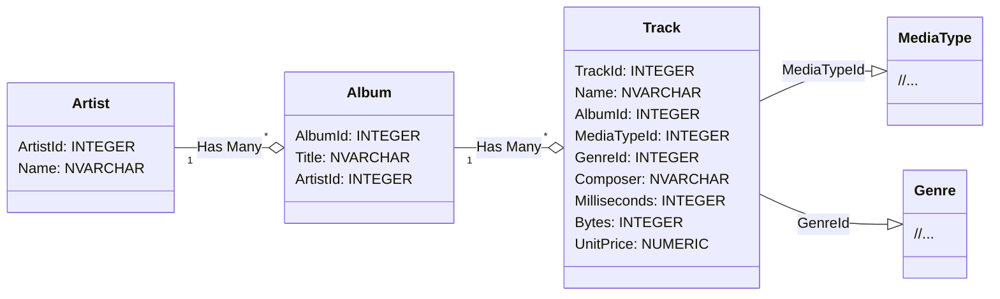
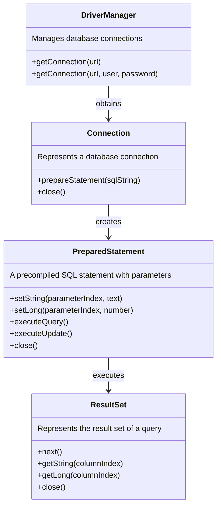

# SQL-tietokantojen käyttö Javasta käsin

Tässä tehtävässä opettelemme muodostamaan yhteyden tietokantaan Java-ohjelmasta käsin ja tekemään yksinkertaisia CRUD-toimenpiteitä (Create, Read, Update & Delete). Tutustumme ohessa käsitteisiin kuten JDBC, DAO ja PreparedStatement.


## JDBC – Java Database Connectivity

Javan standardikirjastoon määritelty [JDBC (Java Database Connectivity) -ohjelmointirajapinta](https://docs.oracle.com/javase/8/docs/technotes/guides/jdbc/) mahdollistaa Java-sovellusten yhdistämisen eri tyyppisiin SQL-tietokantoihin ja erilaisten kyselyiden sekä päivitysten tekemisen Java-koodista käsin.

JDBC ei rajoita sitä, minkä SQL-pohjaisten tietokantojen kanssa sitä voidaan käyttää, vaan eri tietokantoja voidaan hyödyntää käyttämällä niille toteutettuja valmiita ajureita. Sillä ei siis Java-koodisi näkökulmasta ole eroa, käytätkö tietokantana esimerkiksi [MySQL](https://www.mysql.com/)-, [PostgreSQL](https://www.postgresql.org/)- vai [SQLite](https://www.sqlite.org/index.html)-tyyppistä tietokantaa.

Tässä tehtävässä voit käyttää valintasi mukaan joko **MySQL**- tai **SQLite**-tietokantaa. Oletuksena käytämme tiedostopohjaista SQLite-tietokantaa. SQLiten kanssa emme tarvitse erillistä tietokantapalvelinta, joten meidän ei tarvitse huolehtia verkkoyhteyksistä, salasanoista tai asennuksista.


## SQLite

SQLite-tietokanta on paikallinen muisti- tai tiedostopohjainen tietokanta, joka ei vaadi erillistä palvelinta, vaan se voidaan "sulauttaa" (embed) osaksi omaa sovellustamme:

> *"In contrast to many other database management systems, SQLite is not a client–server database engine. Rather, it is embedded into the end program."*
>
> *"SQLite is a popular choice as embedded database software for local/client storage in application software such as web browsers. It is arguably the most widely deployed database engine, as it is used today by several widespread browsers, operating systems, and embedded systems (such as mobile phones), among others. SQLite has bindings to many programming languages.*"
>
> [https://en.wikipedia.org/wiki/SQLite](https://en.wikipedia.org/wiki/SQLite)

SQLite toimii Java-ohjelman näkökulmasta samalla tavalla kuin erilliset tietokantapalvelimet. Myös SQL-kyselyt ovat pääosin samat, esimerkiksi `SELECT ArtistId, Name FROM Artist`. "Keveydestään" ja tiedostopohjaisuudestaan huolimatta SQLite on erittäin merkityksellinen tietokanta ja sitä [käytetäänkin mm. suosituimmissa verkkoselaimissa ja puhelimissa](https://www.sqlite.org/famous.html):

> *"SQLite is built into all mobile phones and most computers and comes bundled inside countless other applications that people use every day."*
>
> https://www.sqlite.org/

Harjoituksessa käytettävä SQLite-tietokanta löytyy valmiina tiedostona tämän projektin [data](./data/)-hakemistosta.


## ⭐ MySQL

MySQL-tietokannan käyttäminen edellyttää tietokantapalvelinta ja tietokannan luontia kyseiselle palvelimelle. Ohjelmointi 2 -kurssin puolesta MySQL-palvelimen asennukseen ja tietokannan luontiin voidaan antaa vain rajallisesti ohjausta. Kannustamme kuitenkin käyttämään tässä harjoituksessa MySQL:ää, mikäli pystyt käyttämään sitä itseohjautuvasti.

Harjoituksissa käytettävän MySQL-tietokannan luontiskriptit löytyvät valmiina tiedostosta [data/Chinook_MySql_AutoIncrementPKs.sql](./data/Chinook_MySql_AutoIncrementPKs.sql).


## Ajurin lisääminen projektiin

JDBC-ajurit, kuten muutkin riippuvuudet, [voidaan ladata itse verkosta ja sijoittaa projektin hakemistoihin](https://www.google.com/search?q=add+jar+file+to+build+path). Riippuvuuksien hallinta on kuitenkin huomattavasti helpompaa, mikäli käytämme automaatiotyökalua kuten Gradle tai Maven. Tässä tehtäväpohjassa sekä SQLite- että MySQL-ajurit ovat  valmiiksi määritettynä Gradle:n [build.gradle](./build.gradle)-tiedostoon, josta koodieditorisi osaa asentaa ne automaattisesti<sup>1</sup>:

```groovy
dependencies {
    // SQLite driver: https://mvnrepository.com/artifact/org.xerial/sqlite-jdbc
    implementation 'org.xerial:sqlite-jdbc:3.43.0.0'

    // MySQL driver: https://mvnrepository.com/artifact/com.mysql/mysql-connector-j
    implementation 'com.mysql:mysql-connector-j:8.1.0'
}
```

<small><sup>1</sup> 🤞 toivottavasti</small>


## Valmis musiikkitietokanta

Käytämme tässä tehtävässä valmista musiikkitietokantaa nimeltä [**Chinook**](https://github.com/lerocha/chinook-database):

> *"Chinook is a sample database available for SQL Server, Oracle, MySQL, etc."*
>
> *"The Chinook data model represents a digital media store, including tables for artists, albums, media tracks, invoices and customers."*
>
> [Luis Rocha, Chinook Database](https://github.com/lerocha/chinook-database)

Chinook-tietokannan tiedostot sijaitsevat valmiiksi tämän tehtäväpohjan [data](./data/)-hakemistossa.

Chinook-tietokanta sisältää lukuisia tietokantatauluja ja paljon valmista dataa, mutta tässä harjoituksessa käytämme ainoastaan `Artist`- ja `Album`-tauluja. Kaikki muut taulut voit jättää harjoitustyössäsi huomioimatta:



💡 *Voit vapaasti tutkia SQLite tietokannan sisältöä avaamalla sen [SQLite-komentorivityökalulla](https://sqlite.org/cli.html) tai jollain [lukuisista graafisista käyttöliittymistä](https://www.google.com/search?q=sqlite+gui). MySQL-tietokannan tutkimisessa voit käyttää valitsemaasi työkalua.*

💡 *Jos tulet vahingossa muuttaneeksi tiedostoja ja haluat perua muutoksen, voit palauttaa versionhallinnasta viimeisimmän version komennolla `git restore data/TIEDOSTONIMI`. Windowsissa muuta kauttaviivan `/` tilalle kenoviiva `\`.*

**Lisätietoja tietokannasta:**

* UML-kaavio: [Chinook-tietokannan Wiki](https://github.com/lerocha/chinook-database/wiki/Chinook-Schema)
* Valmis tietokanta: [Chinook_Sqlite.sqlite](https://github.com/lerocha/chinook-database/raw/master/ChinookDatabase/DataSources/Chinook_Sqlite.sqlite)
* Dokumentaatio: https://github.com/lerocha/chinook-database
* SQL-luontikäskyt: [Chinook_Sqlite.sql](https://raw.githubusercontent.com/lerocha/chinook-database/master/ChinookDatabase/DataSources/Chinook_Sqlite.sql)
* Tietokannan lisenssi: [MIT](https://github.com/lerocha/chinook-database/blob/master/LICENSE.md)


## Pääohjelman suorittaminen

Tehtäväpohja sisältää pääohjelman [**JdbcDemoMain**](./src/main/java/databases/part01/JdbcDemoMain.java). Tämä pääohjelman tarkoitus on auttaa sinua hahmottamaan ja kokeilemaan, miten yhteyksiä muodostetaan ja miten niiden avulla voidaan suorittaa kyselyitä. Voit suorittaa [pääohjelman](./src/main/java/databases/part01/JdbcDemoMain.java) joko koodieditorisi run-painikkeella tai Gradle:n avulla:

```sh
./gradlew run       # Unix
.\gradlew.bat run   # Windows
```

Kun suoritat ohjelman, se tulostaa kaikkien tietokannassa valmiiksi olevien artistien nimet järjestettynä niiden `ArtistId`:n mukaan:

```
AC/DC
Accept
Aerosmith
Alanis Morissette
Alice In Chains
...
```

Tehtävän seuraavissa vaiheissa tätä tulostetta muutetaan hieman.

⭐ *Pääohjelma käyttää oletuksena SQLite-tietokantaa, joten joudut muuttamaan yhteysosoitteen tunnuksineen vastaamaan MySQL-tietokantaasi, mikäli käytät MySQL:ää.*


## JDBC:n perusteet

Tietokantaoperaatiot tehdään JDBC:ssä kolmen keskeisen luokan avulla: **Connection**, **PreparedStatement** ja **ResultSet**. Näillä kolmella on keskeinen rooli tietokantaan yhteyden muodostamisessa, tietokantakyselyiden suorittamisessa ja tulosten käsittelyssä.

1. **[Connection (yhteys)](https://docs.oracle.com/javase/8/docs/api/java/sql/Connection.html)**
    - Yhteys mahdollistaa sovelluksen ja tietokannan välisen vuorovaikutuksen.
    - Yhteydenmuodostus vaatii tietokannan tiedot, kuten SQLite-tiedoston sijainnin. Se voi vaatia myös mm. tietokantapalvelimen osoitteen, käyttäjätunnuksen ja salasanan.
    - Yhteys tulee sulkea käytön jälkeen, jotta käytössä olevat resurssit vapautuvat uudelleenkäytettäviksi.

2. **[PreparedStatement (SQL-lauseke)](https://docs.oracle.com/javase/8/docs/api/java/sql/PreparedStatement.html)**
    - Tapa suorittaa SQL-kyselyitä tietokannassa Java-sovelluksessa.
    - Mahdollistaa SQL-kyselyjen parametrien syöttämisen turvallisesti.
    - Auttaa estämään SQL-injektiota.

3. **[ResultSet (tulokset)](https://docs.oracle.com/javase/8/docs/api/java/sql/ResultSet.html)**
    - ResultSet on tietokannasta saatava tulosjoukko, joka sisältää kyselyn tulokset.
    - ResultSetissä tiedot ovat organisoituina riveihin ja sarakkeisiin.
    - Tulostaulukkoa käytetään tavallisesti silmukan avulla, joka kulkee läpi tulokset ja noutaa tarvittavat tiedot.

Nämä luokat ja niiden väliset suhteet on havainnollistettu seuraavassa kaaviossa:




## Osa 1: Kyselyn luonti ja tulosten käsittely *(perusteet, 20 %)*

Tehtävän ensimmäisessä osassa sinun tulee perehtyä [**JdbcDemoMain**](./src/main/java/databases/part01/JdbcDemoMain.java)-pääohjelmaluokkaan ja tehdä siihen kaksi pientä muutosta.

**Kyselyn muuttaminen**

Annetussa tietokantakyselyssä aineisto on järjestetty `ArtistId`-sarakkeen mukaan. Muuta kyselyä siten, että järjestät artistit aakkosjärjestykseen nimen mukaan.

**Tulosjoukon käsittely**

Pääohjelman alkuperäisessä versiossa jokaisen artistin kohdalla tulostetaan artistin nimi. Muuta ohjelmaa siten, että samalle riville, artistin nimen jälkeen, tulostetaan myös artistin id (`ArtistId`):

```
A Cor Do Som (43)
AC/DC (1)
Aaron Copland & London Symphony Orchestra (230)
Aaron Goldberg (202)
Academy of St. Martin in the Fields & Sir Neville Marriner (214)
```

💡 *Huomaa, että nyt artistit ovat hieman eri järjestyksessä. AC/DC ei ole enää ensimmäisenä.*

Tämä osa tehtävästä tarkastetaan tutkimalla ohjelmasi tulostetta, koska `System.out.println`-kutsuihin perustuvan ohjelmalogiikan testaaminen ohjelmallisesti on hankalaa. Ratkaisu rajoittaa myös koodin uudelleenkäyttöä, koska `main`-metodi ei palauta mitään. Jos tarvitset artistien listausta myöhemmin toisessa osassa ohjelmaa, joudut toistamaan samaa logiikkaa, mikä on virhealtista ja tekee koodista hankalammin ylläpidettävää.

Parempi tapa on eristää logiikka omiin metodeihinsa, jotta sitä voidaan kutsua ohjelman muista osista tai muista ohjelmista. Ohjelman jakaminen osiin helpottaa siis sen **testaamista** ja tekee koodista **uudelleenkäytettävämpää** ja **ylläpidettävämpää**.

🚀 *Jos olet tarkkana, huomaat että yllä SQLite järjesti artistin "AC/DC" virheellisesti ennen artistia "Aaron...". Tämä johtuu siitä, että SQLite:n ORDER BY -vertailu on kirjainkoosta riippuvainen. "Lähes oikea" järjestys kelpaa tämän tehtävän osalta, mutta voit halutessasi järjestää nimet myös kirjainkoosta riippumatta [tämän keskustelun](https://stackoverflow.com/a/2413833) vinkkien mukaan.*


## Osa 2: Olioihin perustuva lähestymistapa *(perusteet, 40 %)*

Tehtävän toisessa osassa tehtävänäsi on hyödyntää olio-ohjelmointia ja jakaa tietokantaa käyttävät operaatiot tarkoituksenmukaisesti erillisiin luokkiin ja metodeihin.

Ohjelman rakenteen ja arkkitehtuurin suunnittelemiseksi on hyviä tunnettuja ja [laajasti käytettyjä suunnittelumalleja (pattern)](https://en.wikipedia.org/wiki/Software_design_pattern), joita noudattamalla tulet soveltaneeksi hyviä käytäntöjä ja koodistasi tulee toivottavasti laadukasta. Ohjelmistokehittäjät noudattavat usein samoja suunnittelumalleja, mikä helpottaa muiden kirjoittamien ohjelmien ymmärtämistä ja koodauskäytäntöjen yhtenäistämistä.

**DAO (Data Access Object)**

Tietokantalogiikan eriyttämiseksi muusta koodista käytetään usein ns. DAO-mallia:

> *"A Data Access Object class can provide access to a particular data resource without coupling the resource's API to the business logic. For example, sample application classes access catalog categories, products, and items using DAO interface `CatalogDAO`."*
>
> Oracle. Data Access Object - Also Known As DAO. https://www.oracle.com/java/technologies/data-access-object.html

**Tehtävä**

Tehtäväpohjan paketissa [databases.part02](./src/main/java/databases/part02/) on valmiina luokat [`Artist`](./src/main/java/databases/part02/Artist.java), [`ArtistDAO`](./src/main/java/databases/part02/ArtistDAO.java) sekä [`ArtistAppMain`](./src/main/java/databases/part02/ArtistAppMain.java):


1. **Artist:**

    Tämä luokka edustaa yksittäisiä artisteja sovelluksessa ja on "aivan tavallinen" luokka. Luokassa ei ole tietokanta- eikä käyttöliittymälogiikkaa. Tällaisesta luokasta käytetään usein nimitystä *model* tai *entity*.

2. **ArtistDAO:**

    ArtistDAO (Data Access Object) -luokka toimii välittäjänä sovelluksen liiketoimintalogiikan ja tietokannan välillä. Sen pääasiallinen tehtävä on tarjota metodeja tietokantaoperaatioihin, jotka liittyvät "Artist" -entiteettiin. Näitä ovat esim artistien luonti, hakeminen, päivittämiseen ja poistamiseen. Tietokantaoperaatioiden toteuttaminen erilliseen Java-luokkaan helpottaa muun sovelluksen työskentelyä tietokannan kanssa, koska muiden luokkien ei tarvitse tuntea taustalla olevaa SQL:ää tai tietokantaan liittyviä yksityiskohtia.

    💡 *ArtistDAO-luokan rooli on ainoastaan toimia välittäjänä tietokannan ja sovelluslogiikan välillä. DAO-luokissa ei ole lainkaan käyttöliittymään liittyvää logiikkaa, kuten tulosteita.*

3. **ArtistAppMain:**

    Tämä luokka toimii uutena pääohjelmana, joka hyödyntää ArtistDAO-luokkaa. Loogisesti tämä luokka vastaa edellisessä osassa käyttämääsi [`JdbcDemoMain`-luokkaa](./src/main/java/databases/part01/JdbcDemoMain.java), mutta tällä kertaa se ei sisällä lainkaan tietokantalogiikkaa.

Yllä esitetty vastuunjakaminen seuraa hyviä periaatteita, jotka tekevät sovelluksen kehittämisestä, ylläpidosta ja skaalautuvuudesta helpompaa. Nyt kun ohjelma on jaettu pienempiin osiin, edellisessä osassa käytetty `main`-metodi saadaan näyttämään paljon yksinkertaisemmalta:

```java
/**
 * Tämä metodi vastaa toiminnallisesti osassa 1 käsiteltyä metodia, joka
 * oli paljon pidempi ja monimutkaisempi.
 */
public static void main(String[] args) {
    ArtistDAO artistDAO = new ArtistDAO(JDBC_URL);
    List<Artist> artists = artistDAO.getArtists();

    for (Artist artist : artists) {
        System.out.println(artist.getName() + " (" + artist.getId() + ")");
    }
}
```

Tehtävän tässä osassa sinun tulee toteuttaa [`ArtistDAO`-luokkaan](./src/main/java/databases/part02/ArtistDAO.java) metodit `getArtists` sekä `getArtistById`. Metodien otsikot ja Javadoc-kommentit löytyvät luokasta valmiina.

Voit suorittaa [`ArtistAppMain`-luokan](./src/main/java/databases/part02/ArtistAppMain.java) koodieditorillasi. Aluksi kyseinen luokka ei tulosta mitään, mutta toteutettuasi DAO-luokan tulosteen pitäisi olla sama kuin tehtävän edellisessä osassa.

DAO-luokkasi testataan yksikkötesteillä, jotka on kirjoitettu [`ArtistDAOTest`-testiluokkaan](./src/test/java/databases/part02/ArtistDAOTest.java). Voit suorittaa testit joko koodieditorisi testaustyökalulla ([VS Code](https://code.visualstudio.com/docs/java/java-testing), [Eclipse](https://www.vogella.com/tutorials/JUnitEclipse/article.html)) tai [Gradle-automaatiotyökalulla](https://docs.gradle.org/current/userguide/java_testing.html):

```sh
./gradlew test --tests ArtistDAOTest      # unix
.\gradlew.bat test --tests ArtistDAOTest  # windows
```

💡 *Älä muuta valmiiden metodien nimiä, parametreja tai paluuarvojen tyyppejä. Muutokset saattavat aiheuttaa ongelmia testauksen kanssa.*

💡 *Yritä välttää saman koodin toistamista molemmissa metodeissa, mikäli mahdollista. Saat toteuttaa tehtävänannossa mainittujen luokkien ja metodien lisäksi myös muita luokkia ja metodeja. Esimerkiksi `Database`-luokka yhteyksien avaamiseksi ja sulkemiseksi voi olla hyvä idea. Toisaalta voit toteuttaa erillisen apumetodin resurssien sulkemiseksi. Metodisi saavat myös kutsua toisiaan: voit kutsua getArtistById-metodissa getArtists-metodia (tehokkuudella ei tässä tehtävässä ole painoarvoa).*

💡 *Tulet mahdollisesti huomaamaan, että yhteyksien sulkeminen "käsin" vaatii monta operaatiota ja koodiriviä. Voit vaihtoehtoisesti perehtyä [Javan try-with-resources](https://www.baeldung.com/java-jdbc)-syntaksiin, jolla saat suljettua resurssit automaattisesti.*


## Osa 3: Tiedon lisääminen, päivittäminen ja poistaminen *(soveltaminen, 40 %)*

Edellisissä osissa olemme hakeneet tietoa `executeQuery`-metodilla. Tällä kertaa tarkoituksena on lisätä, päivittää ja poistaa tietoa [`executeUpdate`-metodilla](https://docs.oracle.com/javase/8/docs/api/java/sql/PreparedStatement.html#executeUpdate--).

Tämän projektin paketista [databases.part03](./src/main/java/databases/part03/) löytyy luokat [`Album`](./src/main/java/databases/part03/Album.java) sekä [`AlbumDAO`](./src/main/java/databases/part03/AlbumDAO.java). Luokkien roolit noudattavat samaa mallia kuin `Artist` ja `ArtistDAO`. Toteuta [`AlbumDAO`-luokkaan](./src/main/java/databases/part03/AlbumDAO.java) seuraavat operaatiot:

* `getAlbumsByArtist(Artist artist)`
* `addAlbum(Album album)`
* `updateAlbum(Album album)`
* `deleteAlbum(Album album)`

Metodit löytyvät [`AlbumDAO`-luokasta](./src/main/java/databases/part03/AlbumDAO.java) valmiina ja niiden kommentit kuvailevat tarkemmin kultakin metodilta vaaditut toiminnot.


**SQL-injektiot ja tietoturva**

Huomaa, että SQL-kyselyjen muodostaminen merkkijonoja yhdistelemällä aiheuttaa tietoturvaongelmia, kuten alla oleva esimerkki havainnollistaa:

[](https://xkcd.com/327/)

*Kuva: Randall Munroe. Exploits of a Mom. [https://xkcd.com/327/](https://xkcd.com/327/). [CC BY-NC 2.5](https://creativecommons.org/licenses/by-nc/2.5/)*

Muista siis käyttää `PreparedStatement`-luokkaa ja sen `setString`-, `setLong`- ja muita metodeita aina lisätessäsi kyselyihin parametreja. `set...`-metodit huolehtivat siitä, että annettua dataa ei tulkita osaksi kyselyä, eli sitä käsitellään vain datana.


**Ratkaisun testaaminen**

Albumien käsittelemiseksi ei ole valmista pääohjelmaa, mutta voit halutessasi luoda uuden pääohjelman, muokata edellisen osan ohjelmaa tai hyödyntää [`AlbumDAOTest`-yksikkötestejä](./src/test/java/databases/part03/AlbumDAOTest.java). `AlbumDAOTest` on tekniseltä toteutukseltaan melko erilainen kuin aikaisemmat testit, koska siinä joudutaan alustamaan testitietokanta aina samaan alkupisteeseen ennen testejä. Voit kuitenkin suorittaa sen aikan kuten muutkin testit, joko koodieditorilla tai Gradlella:

```
./gradlew test --tests AlbumDAOTest      # unix
.\gradlew.bat test --tests AlbumDAOTest  # windows
```


## 🚀 Pro task: Try-with-resources

Yhteyksien sulkeminen "käsin" kutsumalla `close()`-metodia vaatii monta operaatiota ja lukuisia ylimääräisiä koodirivejä. Voit vaihtoehtoisesti perehtyä [Javan try-with-resources](https://www.baeldung.com/java-jdbc)-syntaksiin, jolla saat suljettua resurssit automaattisesti.


## 🚀 Pro task: ympäristömuuttujan hyödyntäminen

Usein samaa koodia suoritetaan lukuisissa erilaisissa ympäristöissä, kuten useiden eri kehittäjien omilla Windows-, Mac- ja Linux- koneilla. Kehittäjien henkilökohtaisten koneiden lisäksi saman koodin täytyy toimia testaus-, staging- ja tuotantoympäristössä, joka saattaa sijaita pilvipalvelussa tai omassa konesalissa. Eri ympäristöissä käytetään eri tietokantoja ja asetuksia, joten niissä tarvitaan eri yhteysosoitteet, käyttäjätunnukset ja muita muuttuvia tietoja esimerkiksi tietokantojen käyttämiseksi.

Ympäristökohtaisia asetuksia ei kirjoiteta suoraan ohjelmakoodiin, jotta koodia ei jouduta muuttamaan, kääntämään ja paketoimaan erikseen jokaista suoritusympäristöä varten. Käyttäjätunnuksia, salasanoja ja API-avaimia ei puolestaan haluta tallentaa ohjelmakoodiin tai versionhallintaan tietoturvasyistä.

Yleinen tapa ratkaista edellä esitettyjä ongelmia on asettaa ympäristökohtaisesti vaihtuvat sekä salaiset arvot käyttöjärjestelmän ympäristömuuttujiin. Sovellus voi ympäristömuuttujien avulla käyttää esimerkiksi kehitys-, testi- tai tuotantokantaa ilman, että ohjelmakoodia muutetaan. Salaiset tiedot, kuten salasanat, jäävät myös pois ohjelmakoodista.

Ympäristömuuttujat ovat eräänlainen käyttöjärjestelmäkohtainen Map-tietorakenne. Ympäristömuuttujien arvoja voidaan Javassa lukea `System.getenv`-metodilla esimerkiksi seuraavasti.

```diff
+ // merkkijono luetaan DATABASE-nimisestä ympäristömuuttujasta: 👍
+ private static final String JDBC_URL = System.getenv("DATABASE");

- // kovakoodattu yhteysosoite, jossa ympäristökohtainen osoite ja selkokielinen salasana: 😱
- private static final String JDBC_URL = "jdbc:mysql://localhost:3306/Chinook?user=root&password=ThisPasswordWillLeak";
```


### Ympäristömuuttujien asettaminen

Voit asettaa VS Code:ssa ympäristömuuttujan muuttamalla ["Run and debug"-asetuksia](https://code.visualstudio.com/docs/java/java-debugging#_configuration-options) (ks. kohta `env`). Eclipsessä voit lisätä ohjelmallesi ympäristömuuttujia tämän [Stack Overflow -ketjun](https://stackoverflow.com/a/12810433) ohjeiden mukaisesti.

Vaihtoehtoisesti ympäristömuuttujia voidaan määritellä koko järjestelmän tasolla:

* [Windowsissa](https://www.google.com/search?q=windows+set+environment+variable)
* [Linuxissa](https://www.google.com/search?q=linux+set+environment+variable)
* [MacOS:ssa](https://www.google.com/search?q=macos+set+environment+variable).


----


# Lisenssit

## Chinook-tietokanta

Chinook-tietokannan on luonut [Luis Rocha](https://github.com/lerocha) ja se on lisensoitu avoimena lähdekoodina [MIT-lisenssillä](https://github.com/lerocha/chinook-database/blob/master/LICENSE.md).


## SQLite-ajurin lisenssi

Lue [Apache License, https://github.com/xerial/sqlite-jdbc/blob/master/LICENSE](https://github.com/xerial/sqlite-jdbc/blob/master/LICENSE).

## MySQL-ajurin lisenssi

Lue [Preface and Legal Notices, https://dev.mysql.com/doc/connector-j/8.1/en/preface.html](https://dev.mysql.com/doc/connector-j/8.1/en/preface.html).


## Tämä oppimateriaali

Tämän tehtävän on kehittänyt Teemu Havulinna ja se on lisensoitu [Creative Commons BY-NC-SA -lisenssillä](https://creativecommons.org/licenses/by-nc-sa/4.0/).

Tehtävänannon, lähdekoodien ja testien toteutuksessa on hyödynnetty ChatGPT 3.5 -kielimallia sekä GitHub copilot -tekoälyavustinta.
